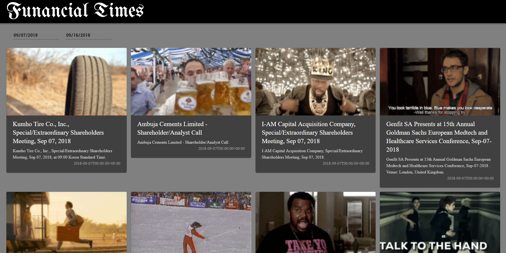

# Funancial Times

The Funancial Times is a news site built for the 21st century. In today's ridiculous economic and political climate, we strived to make a feed that could adequately describe current headlines.

## About
Built for HackMIT 2018, the Funancial Times is a financial events feed which lets you see headlines along with a Gif that relates to it.
Deployed to https://funancial-times.herokuapp.com, but non-working due to an expired Kensho API key.

## What it Looks Like
#### (Click to play on YouTube)

## Built With
* [ReactJS](https://reactjs.org/)
* Kensho Graph API
* Giphy Search API
* Heroku

## Authors
* Ejnar Arechavala
* Zahra Abdulhussein
